<p align="center">
  
</p>

# Momentum for ERPNext

Momentum turns the timesheets and job cards your team already logs in ERPNext into a live management intelligence layer — utilization rates, project profitability, billing leakage, and labor efficiency, all inside your existing ERPNext Desk. No new portal, no new login.

---

## What You Get

### Services Businesses

| Report | Description |
|---|---|
| **Utilization Summary** | Billable vs total hours per employee with utilization % against your configured target |
| **Bench Report** | Employees below target utilization in the selected period, with idle-hour total |
| **Project Cost vs Budget** | Actual cost (hours × costing rate) vs project budget, with variance % and status flag |
| **Realization Rate** | Billed amount vs billable hours at standard rate, by project — spot discounting and write-offs |
| **Unbilled Hours (WIP)** | Billable, uninvoiced timesheet hours by project/client with 0–15 / 16–30 / 30+ day ageing buckets |
| **Client Effort Distribution** | Hours and billing value by client and project across a period |
| **Time Entry Compliance** | Employees with missing or late timesheets vs expected working days |
| **Activity Type Breakdown** | Hours and value by activity type (Dev / Design / Support / Management), with employee count |
| **Task Estimate vs Actual** | Task estimated hours vs actual logged hours, variance and completion % |
| **Margin Trend by Project** | (Billed − Cost) / Billed over time, driven by nightly project snapshots |

### Manufacturing Businesses

| Report | Description |
|---|---|
| **Operation Efficiency Report** | Actual vs standard time per operation and work center, with efficiency % |
| **Labor Cost Variance Report** | Actual labor cost (Job Card hours × work center rate) vs BOM planned operating cost, with variance % |
| **Work Center Utilization** | Booked hours vs available capacity per work center per day, with utilization % |
| **Operator Productivity** | Efficiency % and completed quantity by employee and operation — unassigned operators grouped by work center |
| **Shift & Overtime Analysis** | Hours bucketed by Morning / Afternoon / Evening-Night shift, with overtime flagged against your configured working-hours target |

### Executive / Cross-Pack

| Report | Description |
|---|---|
| **Company Effort Heatmap** | Hour matrix pivoted by Department × Project (services) or Work Center × Operation (manufacturing) — switch views with a single filter |
| **At-Risk Projects and Work Orders** | Projects flagged At Risk or Over Budget from nightly snapshots, and work orders whose actual labor cost exceeds standard cost past your overrun threshold — sorted by severity |

All reports appear inside Frappe's standard Report view. All dashboards appear inside Frappe's native Dashboard view. Nothing outside ERPNext Desk.

---

## Screenshots

<table>
  <tr>
    <td align="center" colspan="2">
      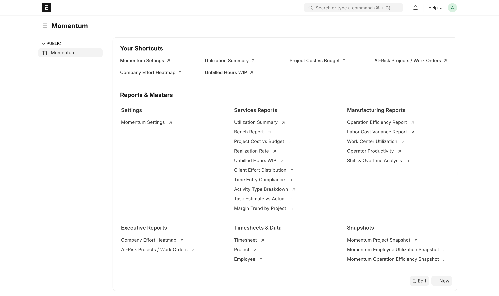<br/>
      <sub><b>Momentum Workspace</b> — All reports, dashboards, and settings accessible from a single hub</sub>
    </td>
  </tr>
  <tr>
    <td align="center" width="50%">
      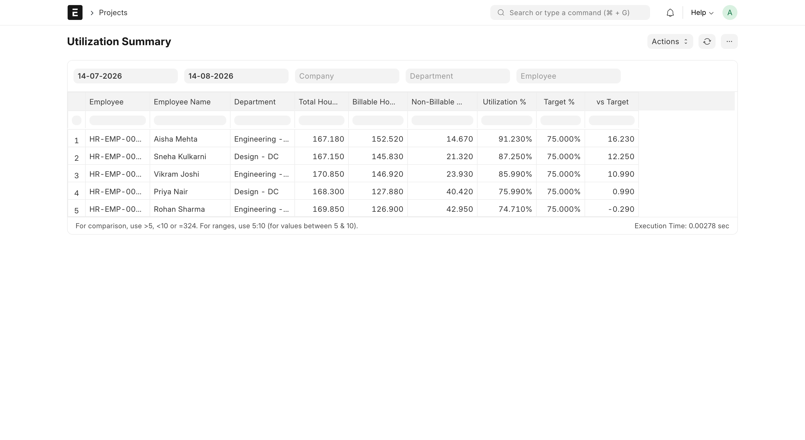<br/>
      <sub><b>Utilization Summary</b> — Billable vs total hours per employee with utilization % vs target</sub>
    </td>
    <td align="center" width="50%">
      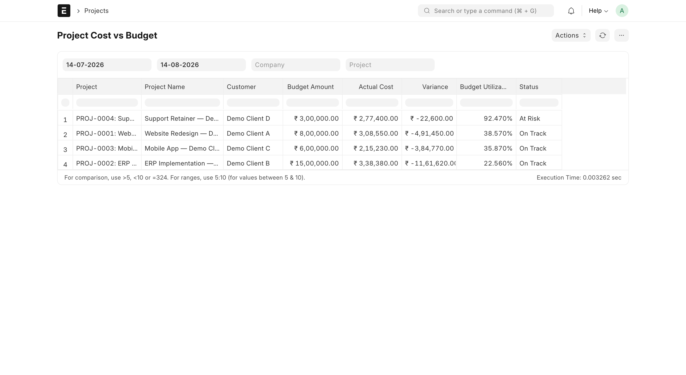<br/>
      <sub><b>Project Cost vs Budget</b> — Actual cost vs budget with variance % and at-risk flagging</sub>
    </td>
  </tr>
  <tr>
    <td align="center" width="50%">
      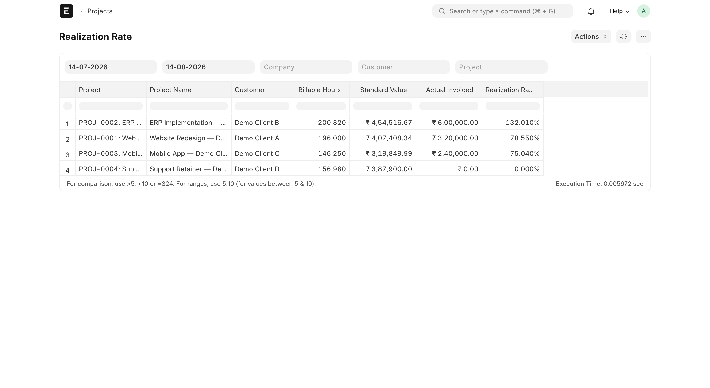<br/>
      <sub><b>Realization Rate</b> — Billed amount vs billable hours at standard rate, by project</sub>
    </td>
    <td align="center" width="50%">
      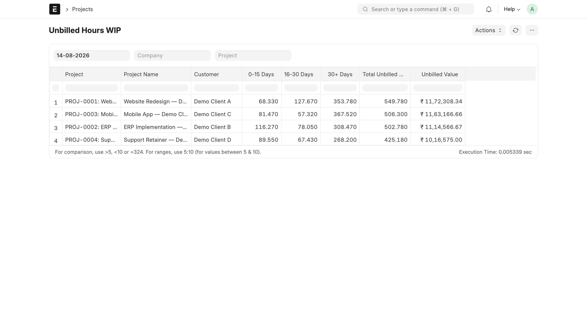<br/>
      <sub><b>Unbilled Hours WIP</b> — Uninvoiced billable hours by project with 0–15 / 16–30 / 30+ day ageing buckets</sub>
    </td>
  </tr>
  <tr>
    <td align="center" width="50%">
      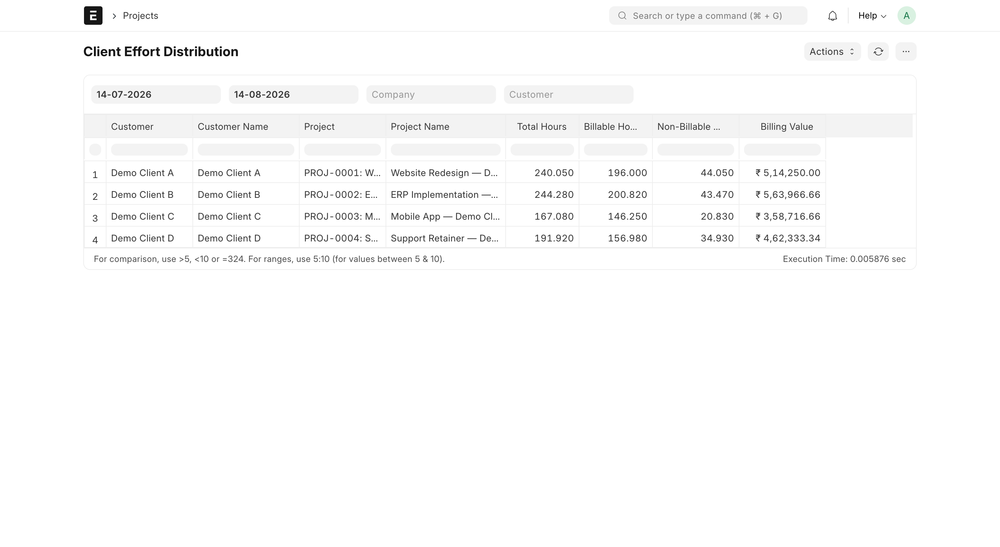<br/>
      <sub><b>Client Effort Distribution</b> — Hours and billing value broken down by client and project</sub>
    </td>
    <td align="center" width="50%">
      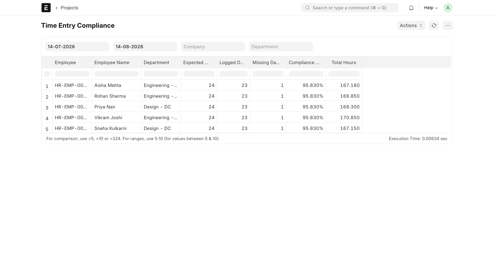<br/>
      <sub><b>Time Entry Compliance</b> — Missing or late timesheets vs expected working days per employee</sub>
    </td>
  </tr>
  <tr>
    <td align="center" width="50%">
      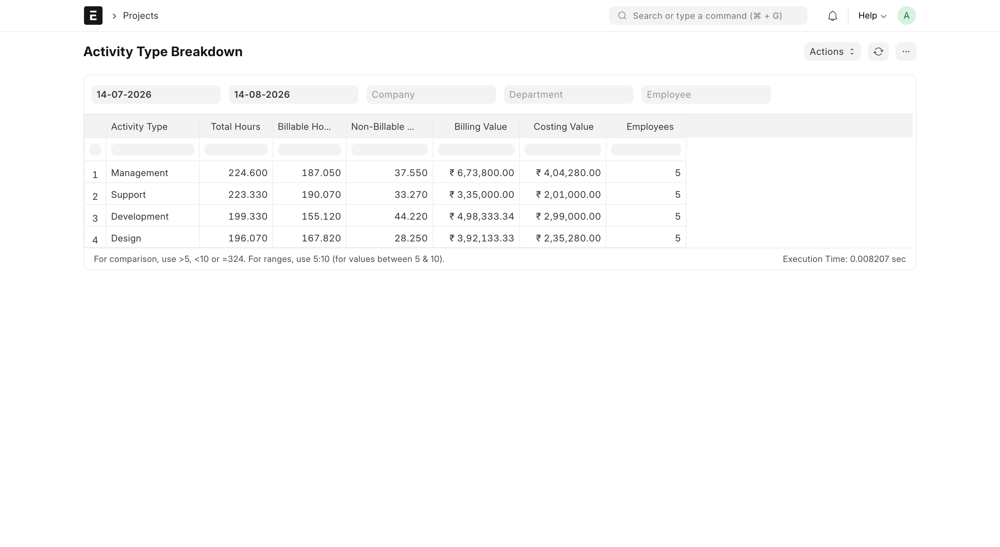<br/>
      <sub><b>Activity Type Breakdown</b> — Hours and billing value by activity type (Dev / Design / Support / Management)</sub>
    </td>
    <td align="center" width="50%">
      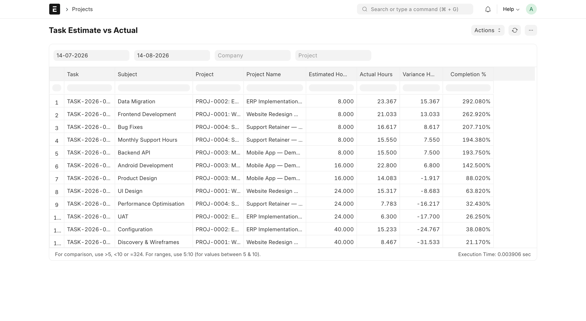<br/>
      <sub><b>Task Estimate vs Actual</b> — Estimated vs logged hours per task with variance and completion %</sub>
    </td>
  </tr>
  <tr>
    <td align="center" width="50%">
      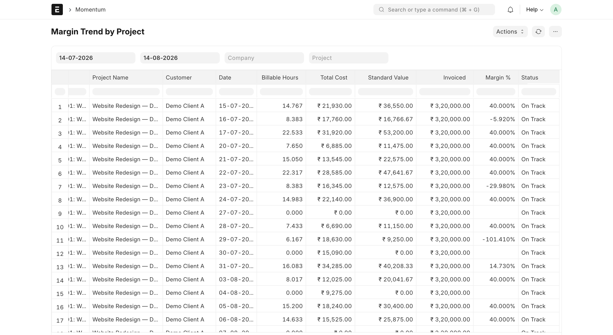<br/>
      <sub><b>Margin Trend by Project</b> — Daily (Billed − Cost) / Billed margin driven by nightly snapshots</sub>
    </td>
    <td align="center" width="50%">
      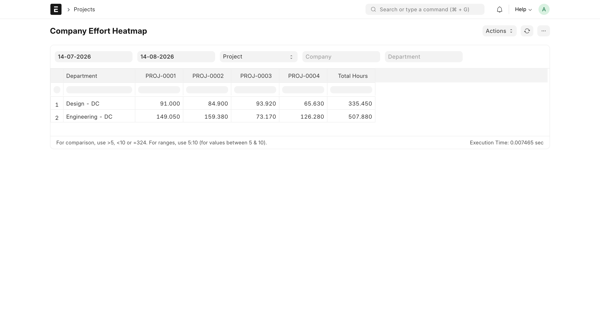<br/>
      <sub><b>Company Effort Heatmap</b> — Hour matrix pivoted by Department × Project or Work Center × Operation</sub>
    </td>
  </tr>
</table>

### Dashboards

<table>
  <tr>
    <td align="center" colspan="2">
      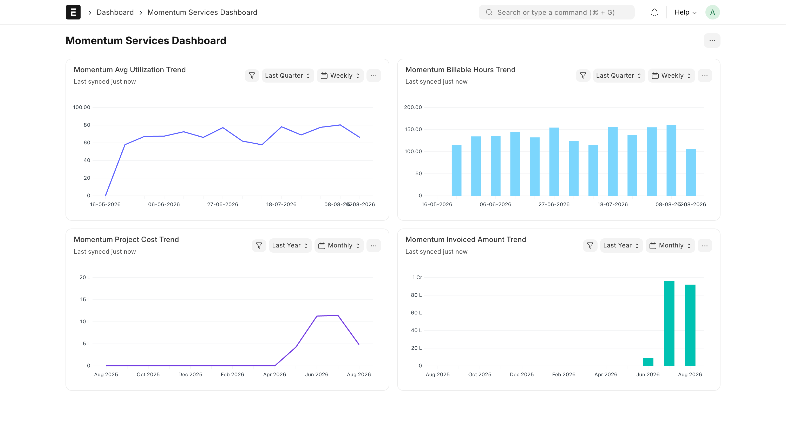<br/>
      <sub><b>Momentum Services Dashboard</b> — Utilization, billable hours, project cost, and invoiced amount trends for services teams</sub>
    </td>
  </tr>
  <tr>
    <td align="center" colspan="2">
      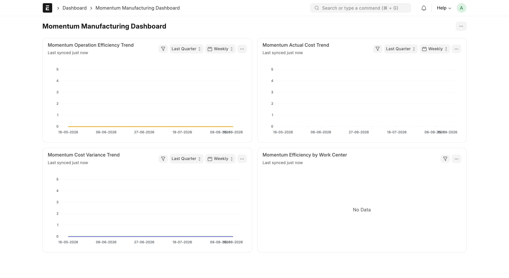<br/>
      <sub><b>Momentum Manufacturing Dashboard</b> — Operation efficiency, actual cost, cost variance, and work center efficiency at a glance</sub>
    </td>
  </tr>
  <tr>
    <td align="center" colspan="2">
      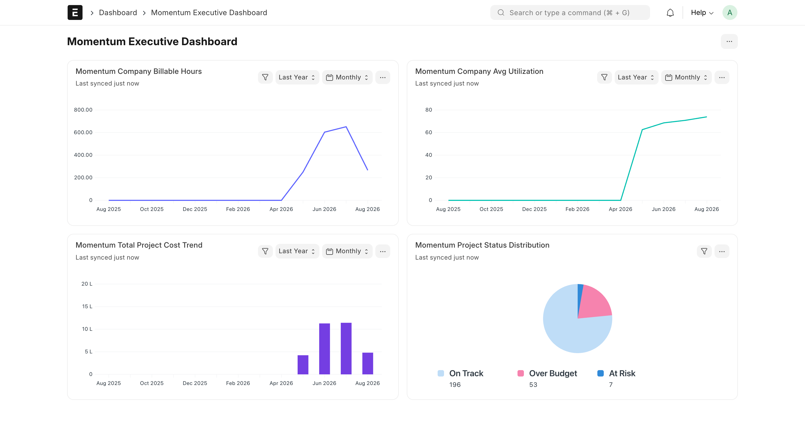<br/>
      <sub><b>Momentum Executive Dashboard</b> — Company-wide billable hours, utilization, project cost, and on-track / at-risk / over-budget status</sub>
    </td>
  </tr>
</table>

---

## Prerequisites

- ERPNext **v15** installed and running on your bench.
- Employees, Projects (for services) or Work Orders / Job Cards (for manufacturing) already being logged in ERPNext.
- Site Administrator access to run bench commands.

---

## Installation

Run the following on your bench server:

```bash
cd /path/to/your/bench

# 1. Download the Momentum app
bench get-app https://github.com/fafadiatech/momentum --branch main

# 2. Install it on your site
bench --site your-site.com install-app momentum

# 3. Run migrations
bench --site your-site.com migrate
```

---

## First-Time Setup (5 minutes)

After installation, complete these steps inside ERPNext:

### Step 1 — Open Momentum Settings
Search for **Momentum Settings** in the search bar (or go to **Awesome Bar → Momentum Settings**).

Configure the following:
| Setting | What it means | Suggested default |
|---|---|---|
| Standard Working Hours Per Day | How many hours counts as a full working day | 8 |
| Utilization Target % | Your firm's billable hours target | 75 |
| Cost Rate Source | Where Momentum reads employee cost rates from | Employee Cost Rate |
| Budget Overrun Threshold % | At what % of budget a project turns "At Risk" | 90 |
| Enable Services Pack | Turn on services reports and dashboard | ✓ |
| Enable Manufacturing Pack | Turn on manufacturing reports and dashboard | As needed |

### Step 2 — Backfill Historical Data
If you have existing timesheet history you want to see in Momentum dashboards, click the **Backfill Snapshots** button on Momentum Settings and enter your desired date range.

This is a one-time step. From then on, Momentum updates its snapshots automatically every night.

### Step 3 — Assign Roles
Go to **Setup → Users** and assign the appropriate Momentum role to each user:

| Role | Who gets it |
|---|---|
| **Momentum Manager** | Delivery heads, ops leads, finance — full access to all reports |
| **Momentum Services Viewer** | Project managers, consultants — read-only access to services reports |
| **Momentum Manufacturing Viewer** | Production supervisors — read-only access to manufacturing reports |

---

## Daily Operation

Once set up, Momentum runs on its own:

- **Every night**, it rebuilds the previous day's snapshot data automatically (utilization, project costs, operation efficiency).
- **Reports** can be run on demand from the Reports module — use date range, company, project, employee, or department filters to slice the data.
- **Dashboards** show rolling trend data based on the nightly snapshots.

---

## Troubleshooting

**Reports show no data**
Make sure timesheets are submitted (not saved as drafts) and that the date range you are filtering on has submitted timesheet rows.

**Dashboard charts are empty**
Run a Backfill Snapshots for the date range you want to see. Charts are driven by snapshot data, not live queries.

**I don't see the Momentum workspace**
Make sure your user has one of the three Momentum roles assigned. Log out and back in after role assignment.

**The nightly job did not run**
Check that the bench scheduler is running on your server (`bench scheduler status`). If it was stopped, restart it and the next night's job will run automatically.

---

## Support

For questions, bugs, or feature requests, contact [Fafadia Tech](mailto:customercare@fafadiatech.com).

---

## License

MIT
